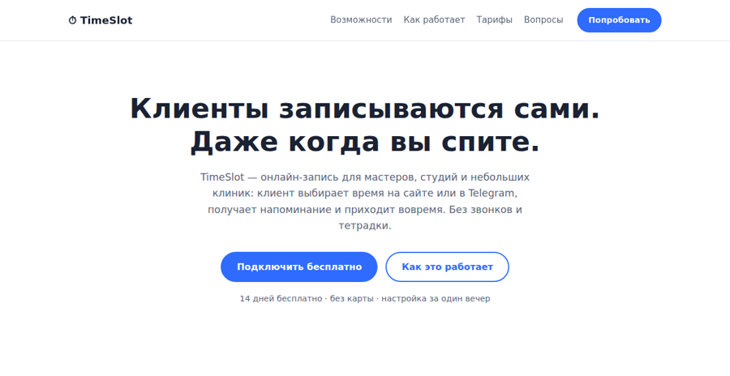

# 🌐 Лендинг с приёмом заявок в Telegram

Продуктовый лендинг с рабочей формой заявки: каждый лид сохраняется в базу и
мгновенно приходит владельцу в Telegram — без CRM, почтовых серверов и платных
сервисов. (Демо-контент — вымышленный сервис онлайн-записи «TimeSlot».)

## Стек

- **Backend:** Python, FastAPI, SQLite
- **Frontend:** чистые HTML / CSS / JavaScript — без фреймворков и сборки
- **Уведомления:** Telegram Bot API
- **Деплой:** Docker / docker-compose

## Скриншот



## Возможности

- 📱 Адаптивная вёрстка (десктоп / планшет / телефон), быстрая загрузка
- 📝 Форма заявки с валидацией на клиенте и сервере (Pydantic), без перезагрузки
- 🛡 Анти-спам: honeypot-поле + ограничение частоты заявок с одного IP
- ✈️ Лиды прилетают в Telegram за секунду
- 💾 Все заявки в SQLite — ничего не теряется, даже если Telegram недоступен
- 🧱 Секции: возможности / как работает / тарифы / FAQ / форма

## Запуск

```bash
cp .env.example .env      # впишите BOT_TOKEN и ADMIN_CHAT_ID
docker compose up -d --build
# сайт на http://localhost:8000
```

Без `BOT_TOKEN` форма всё равно работает — лиды копятся в базе. Все настройки —
в `.env.example`.

## Структура

```
app/main.py        # FastAPI: статика + POST /api/lead + Telegram-уведомления
static/            # index.html, style.css, script.js
```

## Под вашу задачу

Контент лендинга — вымышленный продукт для демонстрации. Под ваш бизнес меняются
тексты, цвета и услуги; форма и доставка лидов в Telegram уже готовы.
Нужен такой сайт? Пишите: [github.com/slakertop1](https://github.com/slakertop1)

## Лицензия

MIT — см. [LICENSE](LICENSE).
